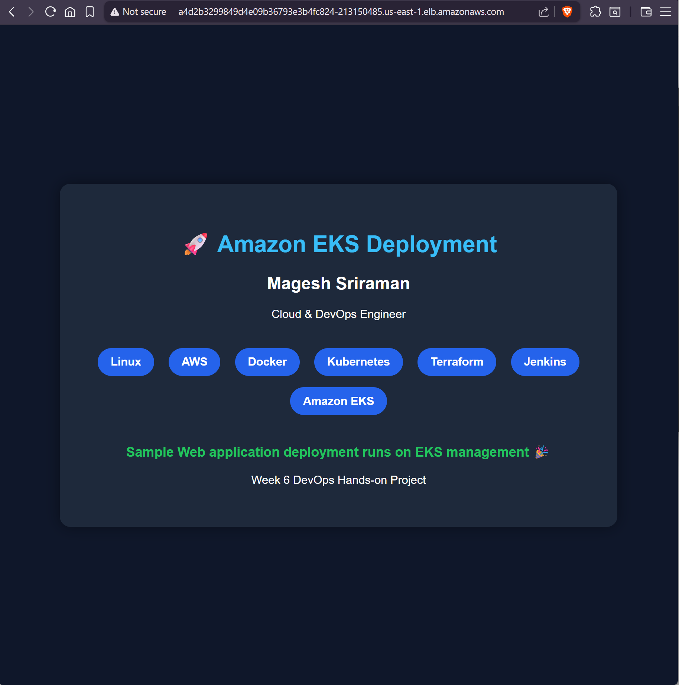

# DevOps Portfolio

## 📌 Overview

This repository demonstrates an end-to-end deployment of a containerized web application on Amazon EKS.

The application is containerized using Docker, stored in Amazon ECR, deployed on Amazon EKS, and exposed using an AWS Load Balancer.

---

## 🛠️ Tech Stack

- Linux
- AWS EC2
- Amazon ECR
- Amazon EKS
- Docker
- Kubernetes
- kubectl
- eksctl

---

## 🏗️ Architecture

Developer
↓
Docker Build
↓
Amazon ECR
↓
Amazon EKS
↓
Kubernetes Service
↓
AWS Load Balancer
↓
Browser

---

## 📂 Repository Structure

```text
app/
kubernetes/
screenshots/
README.md
```

---

## 📸 Deployment Screenshot



---

## 🚀 Current Status

- ✅ Dockerized Application
- ✅ Amazon ECR
- ✅ Amazon EKS Deployment
- ✅ AWS LoadBalancer Service

---

## 📅 Upcoming Enhancements

- Jenkins CI/CD
- Terraform Infrastructure
- AWS Load Balancer Controller
- Ingress
- Helm
- Prometheus & Grafana
- GitHub Actions
